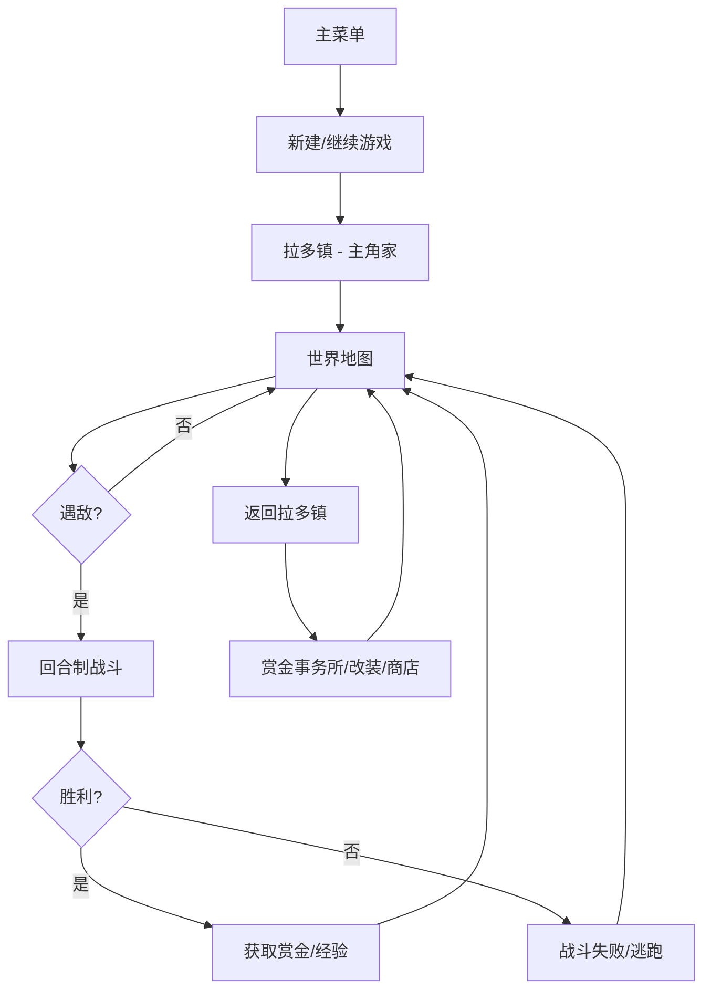

# 《重装机兵》HTML5 重制版 产品需求文档

## 1. 产品概述

《重装机兵》HTML5 重制版是一款基于 FC 原版的 8 位机像素风回合制角色扮演游戏，使用现代浏览器 Canvas 2D 渲染技术还原原作的废土科幻 + 西部荒野美学，核心玩法包括：世界地图探索、回合制战斗（步行 / 战车双模式）、战车改装、赏金任务与经典 BUG 机制。
- 目标用户：FC 时代老玩家、独立像素 RPG 爱好者、想要在浏览器中体验经典 JRPG 的用户。
- 价值：在任何支持 HTML5 的桌面或移动浏览器中即开即玩，无需下载；同时为原版"暴攻 / 暴血 / 暴装甲"等隐藏机制提供完全一致的还原。

## 2. 核心功能

### 2.1 玩家角色

| 角色 | 职业 | 特点 |
|------|------|------|
| 主角 | 战士 | 初始主角，攻防均衡，初始战车：红狼号 |
| 妮娜 | 游侠 | 远程与追击能力，初始装备来复枪 |
| 机械师 | 技师 | 战车改装折扣、机械师专属能力 |

### 2.2 功能模块

1. **主菜单**：开始游戏 / 继续 / 赏金榜 / 退出
2. **世界地图**：非线性的废土地图，包含沙漠、城镇、洞穴、据点等多种地形
3. **拉多镇**：起始城镇，包含赏金首事务所、旅馆、商店、改装车间
4. **战斗系统**：回合制战斗，支持步行 / 战车双模式切换
5. **战车改装系统**：引擎、武器、装甲独立升级；轻量化改造；穿墙秘籍
6. **赏金任务系统**：赏金首列表（马歇尔、戈麦斯、帕鲁、水怪等），按赏金金额排序
7. **物品 / 仓库系统**：HP / 弹药 / 装备背包
8. **经典 BUG 机制**：暴攻 / 暴血 / 暴装甲 等原始 BUG 还原

### 2.3 页面细节

| 页面 / 场景 | 模块 | 功能说明 |
|--------------|------|----------|
| 主菜单 | 标题画面 | 像素字体标题，闪烁选择光标，BGM 循环 |
| 世界地图 | 玩家角色 | 四方向移动，遇敌概率由地形决定 |
| 世界地图 | 战车模式 | 进入战车后视野更广，移动速度提升 |
| 拉多镇 | 建筑物 | 通过像素门进入对应内部场景 |
| 拉多镇 | 赏金事务所 | 显示赏金首列表、当前赏金总额 |
| 战斗 | 指令菜单 | 攻击 / 防御 / 技能 / 物品 / 逃跑 |
| 战斗 | 战车战斗 | 显示 C装置（战车HP），武器菜单分主炮 / 副炮 / SE |
| 改装 | 引擎 | 提升战车移动力 |
| 改装 | 武器 | 安装 / 升级主炮、副炮、SE 武器 |
| 改装 | 装甲 | 提升战车防御力 |
| 改装 | 底盘 | 承载量与重量计算，超载无法作战 |

## 3. 核心流程

玩家从主菜单开始新游戏 → 主角在拉多镇家中醒来 → 与父亲对话获得红狼号 → 出城进入世界地图 → 在地图上行走遇敌进入战斗 → 战斗胜利获得赏金 / 经验 → 回城升级 / 改装 / 接赏金任务 → 击败赏金首获得高额赏金 → 推进剧情。

## 4. 用户界面设计

### 4.1 设计风格

- **主色**：深棕 #2A1A0F（废土土地）、沙黄 #C8A668（沙漠）、废铁灰 #6B6B6B（金属 UI）、血红 #B8232C（高亮 / 危险）
- **辅助色**：像素绿 #5CAA48（HP）、像素金 #E8C170（金币 / 赏金）
- **按钮 / 边框**：仿 FC 时代 2px 黑色硬边描边 + 1px 高光，金属感按钮使用上下渐变。
- **字体**：等宽像素字体（`Press Start 2P` / `VT323` 备选），禁止抗锯齿，强制 `image-rendering: pixelated`。
- **布局**：固定 256×224 像素逻辑画布（FC 原生分辨率），按整数倍放大至视口，保留黑边。
- **图标**：所有图标采用 8×8 / 16×16 自绘像素方块，不使用外部 emoji。

### 4.2 页面设计概览

| 页面 | 模块 | UI 元素 |
|------|------|---------|
| 主菜单 | 标题 | 像素金属字标题，闪烁 ▶ 选择光标，BGM 循环 |
| 世界地图 | 角色 | 16×16 主角 sprite，方向键切换四向行走帧 |
| 战斗界面 | 战斗画面 | 顶部敌我双方状态条，底部指令菜单（蓝底白字硬边） |
| 战斗界面 | 战车 | C 装置 HP 条 + 主炮/副炮/SE 武器子菜单 |
| 改装界面 | 部件槽 | 8 个部件槽位网格，已装备部件高亮，箭头光标移动 |
| 赏金事务所 | 赏金榜 | 仿西部通缉令画风，竖排文本 + 通缉犯像素头像 |

### 4.3 响应式

桌面优先 → 自适应移动端。游戏画布按视口等比整数倍缩放，移动端自动启用触屏方向键与按钮。

### 4.4 视觉细节

- 强制 `image-rendering: pixelated` + `image-rendering: crisp-edges`
- CRT 扫描线效果（可选开关）
- 战斗指令使用蓝底白字硬边方块菜单，与原版一致
- 状态栏 HP / 弹药使用分块像素条（每格 8px）
- 所有文本使用固定宽度像素字体，字号最小 8px
