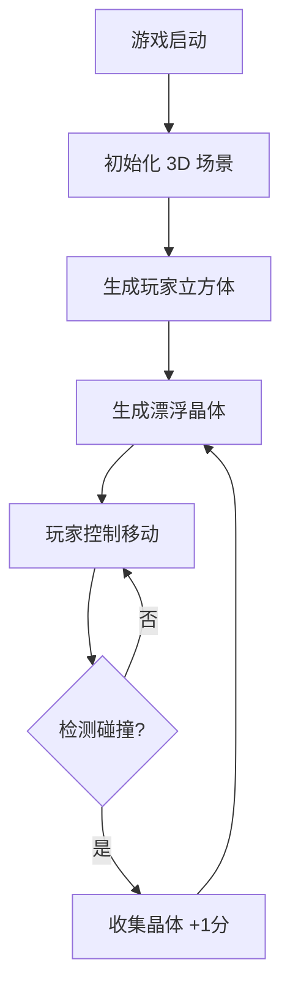

# 3D H5 游戏 - 旋转立方体

## 1. 产品概述

一个简单而视觉精美的 3D H5 小游戏，玩家通过鼠标或触摸控制一个悬浮的立方体，收集场景中漂浮的能量晶体。

- **核心目的**：展示 3D H5 游戏的基础架构，包含场景搭建、角色控制、碰撞检测和分数系统
- **目标用户**：休闲游戏玩家，移动端和桌面端用户
- **产品价值**：轻量级、无需下载、打开即玩的 3D 体验

## 2. 核心功能

### 2.1 用户角色
| 角色 | 游戏方式 | 核心权限 |
|------|----------|----------|
| 玩家 | 通过鼠标/触摸控制立方体移动，收集晶体 | 控制角色、查看分数 |

### 2.2 功能模块
1. **3D 场景**：包含地面、天空盒、动态光照
2. **玩家控制**：鼠标/触摸控制立方体移动
3. **收集系统**：漂浮的晶体，碰撞后消失并增加分数
4. **分数显示**：实时显示收集的晶体数量
5. **游戏循环**：无限模式，晶体被收集后重新生成

### 2.3 页面详情
| 页面名称 | 模块名称 | 功能描述 |
|----------|----------|----------|
| 游戏页面 | 3D 场景 | Three.js 渲染的 3D 世界 |
| 游戏页面 | 玩家立方体 | 可控制的发光立方体 |
| 游戏页面 | 晶体 | 漂浮、旋转的能量晶体 |
| 游戏页面 | UI 层 | 分数显示、游戏提示 |

## 3. 核心流程

### 游戏流程图

### 用户交互流程
1. 用户打开游戏 → 3D 场景加载
2. 用户移动鼠标/触摸 → 立方体向对应方向移动
3. 立方体碰到晶体 → 晶体消失，分数 +1，新晶体生成
4. 循环往复

## 4. 用户界面设计

### 4.1 设计风格
- **主题**：赛博朋克风格 (Cyberpunk)
- **主色调**：深紫色 `#1a0a2e`、霓虹粉 `#ff2d95`、霓虹蓝 `#00f5ff`
- **辅助色**：暗金色 `#ffd700`、深灰色 `#1a1a2e`
- **按钮风格**：圆角、发光边框、悬停时脉冲动画
- **字体**：Orbitron (Google Fonts) - 科技感强
- **布局**：全屏 3D 场景，UI 浮于顶层

### 4.2 页面设计概述
| 页面名称 | 模块名称 | UI 元素 |
|----------|----------|---------|
| 游戏页面 | 3D 场景 | 深色背景、网格地面、雾效果 |
| 游戏页面 | 玩家立方体 | 发光材质、阴影 |
| 游戏页面 | 能量晶体 | 旋转的八面体、粒子特效 |
| 游戏页面 | 分数显示 | 右上角，霓虹发光文字 |
| 游戏页面 | 游戏提示 | 底部居中，操作说明 |

### 4.3 响应式设计
- 桌面端：鼠标控制
- 移动端：触摸控制
- 自动适应屏幕尺寸

### 4.4 3D 场景指导
- **环境**：深紫色渐变天空盒，粒子星空背景
- **光照**：环境光 + 点光源（玩家立方体发光）
- **相机**：透视相机，俯视角度，跟随玩家
- **后期处理**：Bloom 效果（发光）、抗锯齿
- **资产**：程序化生成的几何体，无外部模型依赖
- **性能目标**：60 FPS，移动端 30 FPS+

## 5. 技术选型

- **3D 引擎**：Three.js (r150+)
- **构建工具**：Vite
- **渲染**：WebGL 2.0
- **动画**：Three.js 内置动画系统 + GSAP (可选)
- **物理**：简易 AABB 碰撞检测（无外部物理库）
