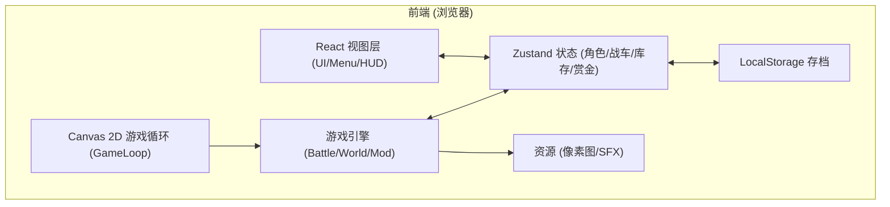
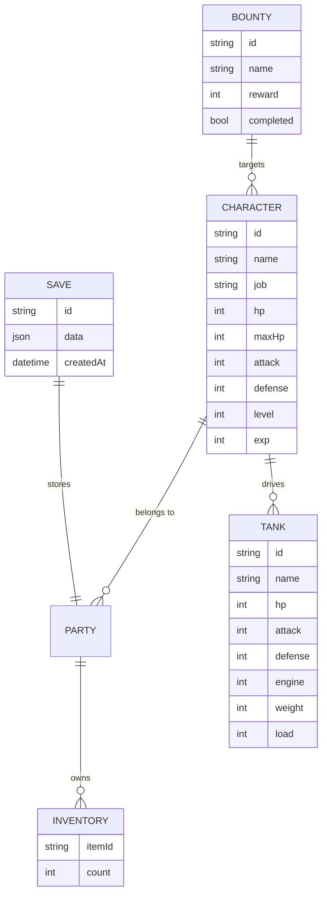

# 《重装机兵》HTML5 重制版 技术架构

## 1. 架构设计



游戏本体使用 Canvas 2D 自渲染游戏循环（与 FC 原版一致的逻辑画布），React 仅承担外层 UI、菜单、HUD、设置等界面。

## 2. 技术栈

- **前端框架**：React 18 + TypeScript + Vite
- **样式**：TailwindCSS 3
- **状态管理**：Zustand
- **渲染**：HTML5 Canvas 2D（游戏画布）+ React（菜单 / HUD）
- **资源**：纯前端自绘像素图（程序化生成 + PNG 资源），无后端
- **存档**：浏览器 `localStorage`
- **路由**：单页应用，通过 Zustand 控制场景切换
- **构建**：Vite 5

## 3. 路由 / 场景定义

| 路由 | 用途 |
|------|------|
| `/` | 主菜单 / 标题画面 |
| `/game` | 游戏主场景（内含世界地图、城镇、战斗等子场景） |
| `/bounty` | 赏金榜查看（独立 HUD 弹层） |
| `/settings` | 设置（BGM、音效、扫描线开关） |

> 实际开发中通过 Zustand `currentScene` 状态机驱动，React Router 仅作为壳入口。

## 4. API 定义

无后端服务。所有数据使用前端 mock 与运行时状态。如需分享存档，可使用 URL `?save=base64` 实现纯前端分享。

## 5. 服务器架构

无需后端。完全离线 / 静态部署即可。

## 6. 数据模型

### 6.1 数据模型定义



### 6.2 初始数据（DDL/JSON Schema）

```ts
type Job = 'warrior' | 'ranger' | 'mechanic'

interface Character {
  id: string
  name: string
  job: Job
  level: number
  exp: number
  hp: number
  maxHp: number
  attack: number
  defense: number
}

interface Tank {
  id: string
  name: string
  hp: number
  maxHp: number
  cHp: number
  cMaxHp: number
  engine: number
  chassis: number
  weight: number
  load: number
  mainWeapon?: Weapon
  subWeapon?: Weapon
  seWeapon?: Weapon
}

interface Bounty {
  id: string
  name: string
  reward: number
  hp: number
  attack: number
  defense: number
  completed: boolean
}
```

## 7. 关键模块

- `src/game/engine.ts`：游戏主循环（60 FPS 固定步长）
- `src/game/world.ts`：世界地图探索、碰撞与遇敌
- `src/game/town.ts`：拉多镇 NPC 与建筑交互
- `src/game/battle.ts`：回合制战斗、暴攻 / 暴血 / 暴装甲 BUG 实现
- `src/game/mod.ts`：战车改装系统与载重计算
- `src/game/pixel.ts`：像素图绘制工具（无抗锯齿精灵、Tile 地图）
- `src/game/save.ts`：存档读写
- `src/components/*`：React UI（菜单、HUD、改装、赏金榜）
- `src/store/gameStore.ts`：Zustand 全局状态
