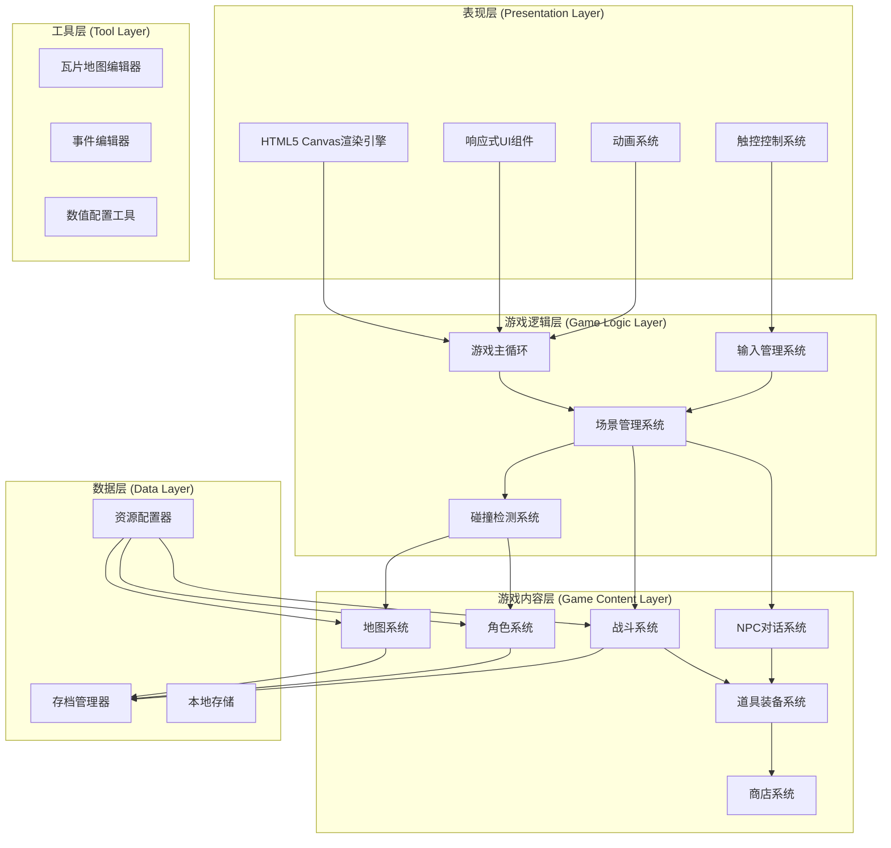

# 重装机兵H5版 - 技术架构文档

## 1. 架构设计



## 2. 技术选型

### 2.1 前端技术栈

| 技术 | 版本 | 用途 |
|------|------|------|
| 原生HTML5 | - | 页面结构 |
| 原生CSS3 | - | 样式和动画 |
| 原生JavaScript | ES6+ | 游戏逻辑 |
| HTML5 Canvas | 2D | 游戏渲染 |
| Web Audio API | - | 音效处理 |
| Service Worker | - | 离线缓存 |

### 2.2 开发工具

| 工具 | 用途 |
|------|------|
| Visual Studio Code | 代码编辑器 |
| Tiled Map Editor | 瓦片地图制作 |
| Aseprite | 像素美术素材 |
| Chrome DevTools | 调试和性能分析 |

### 2.3 第三方库（按需）

| 库 | 用途 | 是否必须 |
|---|------|----------|
| - | 纯原生实现 | 核心必需 |
| howler.js | 音频管理 | 可选 |
| localforage | IndexedDB封装 | 可选 |

## 3. 路由定义

### 3.1 页面路由

| 路由 | 页面 | 功能 |
|------|------|------|
| / | index.html | 游戏入口 |
| /play | play.html | 游戏主界面 |
| /editor | editor.html | 地图编辑器（开发用） |

### 3.2 游戏状态路由

| 状态 | 说明 | 渲染目标 |
|------|------|----------|
| TITLE | 标题画面 | Canvas |
| WORLD_MAP | 世界地图 | Canvas |
| BATTLE | 战斗画面 | Canvas |
| MENU | 菜单界面 | Canvas |
| DIALOGUE | 对话界面 | Canvas |
| SHOP | 商店界面 | Canvas |
| SETTINGS | 设置界面 | DOM |

## 4. 核心模块设计

### 4.1 渲染引擎

```javascript
// 核心类结构
class Renderer {
    canvas: HTMLCanvasElement
    ctx: CanvasRenderingContext2D
    width: number
    height: number
    
    // 方法
    clear(): void
    drawImage(sprite, x, y): void
    drawText(text, x, y, options): void
    drawRect(x, y, w, h, color): void
    render(): void
}
```

### 4.2 游戏主循环

```javascript
class GameLoop {
    lastTime: number
    deltaTime: number
    fps: number
    
    // 方法
    start(): void
    stop(): void
    update(deltaTime): void
    render(): void
    calculateDeltaTime(): number
}
```

### 4.3 输入系统

```javascript
class InputManager {
    keys: Map<string, boolean>
    touches: Touch[]
    mouse: {x, y, down}
    joystick: {x, y, active}
    
    // 方法
    handleKeyDown(event): void
    handleKeyUp(event): void
    handleTouchStart(event): void
    handleTouchMove(event): void
    handleTouchEnd(event): void
    isKeyPressed(key): boolean
    getJoystickVector(): Vector2
}
```

### 4.4 地图系统

```javascript
class TileMap {
    tileset: Image
    mapData: number[][]
    width: number
    height: number
    tileWidth: number
    tileHeight: number
    
    // 方法
    loadMap(data): void
    getTile(x, y): number
    isCollidable(x, y): boolean
    render(camera): void
}
```

### 4.5 角色系统

```javascript
class Character {
    x: number
    y: number
    sprite: Sprite
    direction: Direction
    speed: number
    state: CharacterState
    
    // 方法
    update(deltaTime): void
    move(direction): void
    interact(): void
    render(renderer): void
}
```

### 4.6 战斗系统

```javascript
class BattleSystem {
    playerTeam: Character[]
    enemyTeam: Enemy[]
    currentTurn: number
    battleState: BattleState
    
    // 方法
    startBattle(enemies): void
    executeTurn(action): void
    calculateDamage(attacker, defender): number
    checkBattleEnd(): BattleResult
}
```

### 4.7 存档系统

```javascript
class SaveManager {
    storage: Storage
    
    // 方法
    save(slot, data): Promise<void>
    load(slot): Promise<SaveData>
    getSaveList(): SaveInfo[]
    deleteSave(slot): Promise<void>
    autoSave(): void
}
```

## 5. 数据模型

### 5.1 存档数据结构

```typescript
interface SaveData {
    version: string
    timestamp: number
    playTime: number
    
    player: {
        name: string
        level: number
        exp: number
        hp: number
        maxHp: number
        attack: number
        defense: number
        gold: number
        position: {x: number, y: number, mapId: string}
        inventory: Item[]
        equipment: Equipment[]
    }
    
    tanks: Tank[]
    
    gameFlags: Map<string, any>
    
    npcStates: Map<string, NPCState>
}
```

### 5.2 物品数据结构

```typescript
interface Item {
    id: string
    name: string
    type: 'consumable' | 'equipment' | 'key'
    description: string
    effect?: ItemEffect
    price: number
}

interface Equipment extends Item {
    slot: 'weapon' | 'armor' | 'accessory'
    attackBonus?: number
    defenseBonus?: number
    hpBonus?: number
}
```

### 5.3 地图数据结构

```typescript
interface MapData {
    id: string
    name: string
    width: number
    height: number
    tileset: string
    layers: {
        ground: number[][]
        building: number[][]
        collision: boolean[][]
        events: Event[]
    }
    npcs: NPCData[]
    warps: WarpPoint[]
}
```

## 6. 资源加载策略

### 6.1 资源类型

| 资源类型 | 格式 | 加载方式 |
|---------|------|----------|
| 瓦片图 | PNG | 预加载 |
| 角色精灵 | PNG | 预加载 |
| 敌人精灵 | PNG | 按需加载 |
| 音效 | MP3/OGG | 按需加载 |
| 背景音乐 | MP3/OGG | 流式播放 |
| 地图数据 | JSON | 按需加载 |

### 6.2 加载流程

```
游戏启动
    ↓
显示加载界面
    ↓
加载核心资源（瓦片、角色精灵）
    ↓
加载用户存档（如有）
    ↓
进入标题画面
    ↓
后台加载当前地图资源
    ↓
进入游戏
    ↓
按需加载其他资源
```

### 6.3 缓存策略

- Service Worker缓存所有静态资源
- IndexedDB缓存已加载的瓦片图
- localStorage缓存用户设置
- 内存缓存常用精灵图

## 7. 性能优化方案

### 7.1 渲染优化

- **视口裁剪**：只渲染可视区域内的瓦片
- **脏矩形渲染**：只重绘变化区域
- **精灵批处理**：合并相同类型的绘制调用
- **离屏Canvas**：预渲染静态元素

### 7.2 内存优化

- **对象池**：复用战斗动画、特效对象
- **资源释放**：切换场景时释放未使用资源
- **延迟加载**：非关键资源延迟加载

### 7.3 网络优化

- **压缩资源**：使用WebP格式图片
- **分块加载**：资源分批加载显示进度
- **离线支持**：Service Worker实现离线游戏

## 8. 触控适配方案

### 8.1 触控控件布局

```
┌────────────────────────────────┐
│ [菜单]           [小地图]      │
│                                │
│                                │
│                                │
│                                │
│                                │
│                                │
│   [取消]  [确认]               │
│              ⬤ ← 虚拟摇杆     │
└────────────────────────────────┘
```

### 8.2 触控参数

| 参数 | 值 | 说明 |
|------|------|------|
| 摇杆直径 | 100px | 最大触控区域 |
| 摇杆球直径 | 40px | 可视摇杆 |
| 死区 | 10px | 中心区域不响应 |
| 按钮大小 | 60px | 确认/取消按钮 |
| 按钮间距 | 20px | 按钮之间距离 |

### 8.3 手势识别

| 手势 | 动作 |
|------|------|
| 单指滑动 | 虚拟摇杆控制移动 |
| 单指点击（左） | 无操作 |
| 单指点击（右） | 确认/交互 |
| 双指捏合 | 缩放画面（可选） |
| 长按 | 显示物品信息 |

## 9. 目录结构

```
metal-max-h5/
├── index.html                 # 游戏入口
├── css/
│   ├── main.css              # 主样式
│   ├── ui.css                # UI组件样式
│   ├── mobile.css            # 移动端样式
│   └── animations.css        # 动画样式
├── js/
│   ├── core/
│   │   ├── Game.js           # 游戏主类
│   │   ├── GameLoop.js       # 游戏循环
│   │   ├── Renderer.js       # 渲染引擎
│   │   └── InputManager.js   # 输入管理
│   ├── systems/
│   │   ├── SceneManager.js   # 场景管理
│   │   ├── TileMap.js         # 瓦片地图
│   │   ├── Collision.js       # 碰撞检测
│   │   ├── SaveManager.js     # 存档管理
│   │   └── AudioManager.js    # 音频管理
│   ├── entities/
│   │   ├── Character.js       # 角色基类
│   │   ├── Player.js          # 玩家角色
│   │   ├── NPC.js             # NPC
│   │   ├── Enemy.js           # 敌人
│   │   └── Tank.js            # 战车
│   ├── battle/
│   │   ├── BattleSystem.js    # 战斗系统
│   │   ├── BattleUI.js        # 战斗界面
│   │   └── Skill.js           # 技能
│   ├── ui/
│   │   ├── Menu.js            # 菜单
│   │   ├── DialogueBox.js     # 对话框
│   │   ├── ShopUI.js          # 商店
│   │   └── MobileControls.js  # 触控控件
│   └── data/
│       ├── maps.js            # 地图数据
│       ├── items.js           # 物品数据
│       ├── enemies.js         # 敌人数据
│       └── dialogues.js       # 对话数据
├── assets/
│   ├── tilesets/             # 瓦片图
│   ├── sprites/
│   │   ├── characters/        # 角色精灵
│   │   ├── enemies/           # 敌人精灵
│   │   └── ui/               # UI素材
│   ├── audio/
│   │   ├── se/               # 音效
│   │   └── bgm/              # 背景音乐
│   └── fonts/                # 字体
├── maps/                     # 地图JSON文件
├── data/                     # 游戏配置数据
├── sw.js                     # Service Worker
├── manifest.json              # PWA配置
└── README.md                 # 项目说明
```

## 10. 开发规范

### 10.1 代码规范

- 使用ES6+语法
- 类名使用PascalCase
- 方法名使用camelCase
- 常量使用UPPER_SNAKE_CASE
- 文件编码UTF-8
- 缩进2空格

### 10.2 命名规范

| 类型 | 命名规范 | 示例 |
|------|----------|------|
| 类 | PascalCase | `class TileMap` |
| 变量 | camelCase | `let playerX` |
| 常量 | UPPER_SNAKE | `TILE_SIZE` |
| 函数 | camelCase | `function updateMap()` |
| 文件 | kebab-case | `tile-map.js` |
| CSS类 | kebab-case | `.game-container` |

### 10.3 注释规范

```javascript
/**
 * 类描述
 */
class ExampleClass {
    /**
     * 方法描述
     * @param {string} param - 参数描述
     * @returns {number} 返回值描述
     */
    method(param) {
        // 单行注释
        let value = 0; // 行尾注释
        
        /* 
         * 多行注释
         * 用于复杂逻辑说明
         */
    }
}
```

## 11. 测试计划

### 11.1 单元测试

- 渲染系统基本功能
- 输入系统事件响应
- 碰撞检测算法
- 战斗伤害计算

### 11.2 集成测试

- 场景切换流程
- 存档读写功能
- 战斗完整流程
- UI交互响应

### 11.3 兼容性测试

- Chrome浏览器（最新）
- Firefox浏览器（最新）
- Safari浏览器（最新）
- Edge浏览器（最新）
- iOS Safari
- Android Chrome

### 11.4 性能测试

- 帧率稳定性（目标60FPS）
- 内存占用峰值
- 加载时间
- 触控响应延迟

## 12. 部署方案

### 12.1 静态部署

- 使用Webpack/Vite打包
- CDN加速资源分发
- 启用Gzip压缩
- 配置Cache-Control

### 12.2 PWA支持

```json
{
  "name": "重装机兵H5",
  "short_name": "重装机兵",
  "start_url": "/",
  "display": "standalone",
  "background_color": "#1A252F",
  "theme_color": "#2C3E50",
  "icons": [...]
}
```

### 12.3 域名建议

- 主站：metalmax.game（示例）
- 静态资源：cdn.metalmax.game（示例）

## 13. 风险管理

### 13.1 技术风险

| 风险 | 影响 | 缓解措施 |
|------|------|----------|
| Canvas性能不足 | 高 | 优化渲染逻辑、限制同屏对象数 |
| 移动端触控延迟 | 中 | 使用touch事件、优化事件处理 |
| 浏览器兼容性问题 | 中 | 渐进增强、特性检测 |
| 大地图内存溢出 | 中 | 分块加载、内存监控 |

### 13.2 项目风险

| 风险 | 影响 | 缓解措施 |
|------|------|----------|
| 资源制作周期长 | 高 | 使用像素工具批量生成 |
| 测试覆盖不足 | 中 | 自动化测试、众测 |
| 维护成本高 | 低 | 模块化设计、文档完善 |
